# IP19 Maintenance Report Requirement

Source attachments: `IP19_TDD_Markdown_with_Assets.zip` and `IP19_Equivalent_Report_Technical_Design_and_SAP_Escalation_Pack.docx`.

This page preserves the technical design, SAP escalation position, evidence screenshots, and future implementation notes for the IP19-equivalent maintenance planning report.

Prepared Date: 2026-07-02  
System Context: SAP S/4HANA Cloud Public Edition  
Primary Solution Objects: YY1_IP19_MAINTPLAN_CUBE, YY1_Q_IP19_MAINT_SCHED

# 1. Executive Summary

CFA required a practical equivalent for the ECC IP19 maintenance planning report in SAP S/4HANA Cloud Public Edition. The standard SAP Maintenance Plan Scheduling Overview analytical query provided important scheduling information but did not provide all fields required by maintenance planners in one operational report.

A custom reporting solution was successfully delivered using SAP clean-core key-user extensibility and embedded analytics capabilities. The delivered solution uses a custom analytical cube, a custom analytical query and a Web Dynpro Grid Application artifact generated through Manage KPIs and Reports. This provided a cleaner, more SAP-like operational report than the raw multidimensional query output and avoided immediate need for developer extensibility.

The report now provides the core IP19 replacement information, including maintenance plan, maintenance item, item description, equipment, equipment description, functional location, functional location description, main work center, planned date, completion date, maintenance order, call status, planner group and operation short text.

The remaining critical gap is Due Packages. Business confirmed that Due Packages is mandatory and go-live cannot proceed without a supported solution for this field. Investigation established that the information required to support Due Packages is visible through the SAP-delivered CDS object I_MAINTTSKLISTSTRGYPACKAGETP in Customer Data Browser, but the object is not available for Custom CDS Views and returned HTTP 403 Forbidden when opened as an ADT DDL source. This indicates that the data exists but is not currently available through the required customer extensibility consumption model.

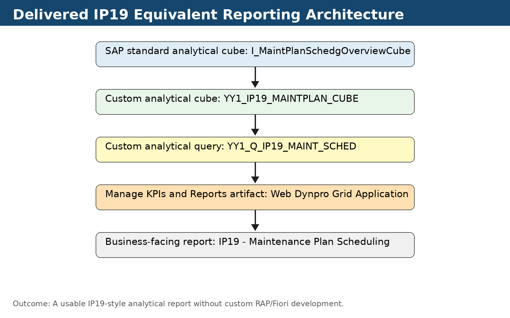

# 2. Business Requirement and Problem Statement

The business requirement was to provide a single IP19-equivalent maintenance planning report. In ECC, IP19 was used by planners to gain forward visibility of maintenance plans and scheduled calls. In S/4HANA Cloud Public Edition, the available standard reporting options did not provide the same one-stop operational view.

The key business problem was not only the absence of a screen named IP19. The real problem was that planners needed a consolidated schedule view that combined plan, item, object, work center, call and operational text information. Manually combining multiple reports would be slow, error-prone and unsuitable for operational planning.

| Business Field | Requirement Status | Comment |
|---|---|---|
| Equipment | Mandatory | Available in standard cube and delivered in custom report. |
| Description of Technical Object | Mandatory | Delivered using equipment and functional location text associations. |
| Main Work Center | Mandatory | Available through scheduling cube / operation association. |
| Planned Date | Mandatory | Available and used as key planning filter. |
| Operation Short Text | Mandatory | Delivered through maintenance order operation association. |
| Completion Date | Mandatory | Available in scheduling cube. |
| Maintenance Plan | Mandatory | Available in scheduling cube. |
| Maintenance Item Description | Mandatory | Available in standard cube and exposed in query. |
| Call Status | Mandatory | Available in standard cube. |
| Maintenance Order | Mandatory | Available in standard cube. |
| Planner Group | Mandatory | Available in standard cube. |
| Due Packages | Business critical | Remaining gap; must be derived from strategy package data. |

# 3. Scope and Assumptions

The solution was designed for SAP S/4HANA Cloud Public Edition using clean-core extension mechanisms. The primary objective was to avoid custom development unless required. The team therefore evaluated standard SAP apps first, then standard analytical providers, then Custom CDS Views and Custom Analytical Queries, then Manage KPIs and Reports, and only later investigated Developer Extensibility for the remaining gap.

The delivered report is analytical and read-only. It is intended for operational planning visibility, not transactional maintenance plan maintenance. The report is expected to support filtering, layout variants, data export and planner-friendly review.

# 4. Standard SAP Analysis

The first design principle was to avoid unnecessary custom development. The standard Maintenance Plan Scheduling Overview query was assessed as the starting point because it is SAP-delivered and already aligned with maintenance scheduling. The underlying analytical provider identified during the exercise was I_MaintPlanSchedgOverviewCube.

The standard analytical provider already contained several useful fields, including maintenance plan, maintenance item, equipment, main work center, planned date, completion date, maintenance order, call status and planner group. However, the standard query and cube did not provide all mandatory planner fields in the required report shape. Equipment Description, Functional Location Description and Operation Short Text required additional modelling. Due Packages was not available as a simple field.

# 5. Investigation Timeline

The investigation was iterative and practical. Each step was tested directly in the tenant and adjusted based on system behavior rather than assumptions. This timeline is important because it demonstrates that the final solution was not selected prematurely; multiple possible paths were evaluated and eliminated.

# 6. Target Architecture and Design Decisions

The selected architecture uses SAP embedded analytics rather than custom ABAP or a bespoke UI. This was the appropriate design because the majority of the requirement was read-only analytical reporting. The most important architectural decision was to create an Analytical Cube, not a Standard CDS View, because only the Analytical Cube scenario could be consumed by Custom Analytical Queries.

The Custom Analytical Query was then exposed via Manage KPIs and Reports using the Web Dynpro Grid Application artifact type. This was selected over a SAC story or raw multidimensional analysis because the business requirement was an operational report, not a dashboard.

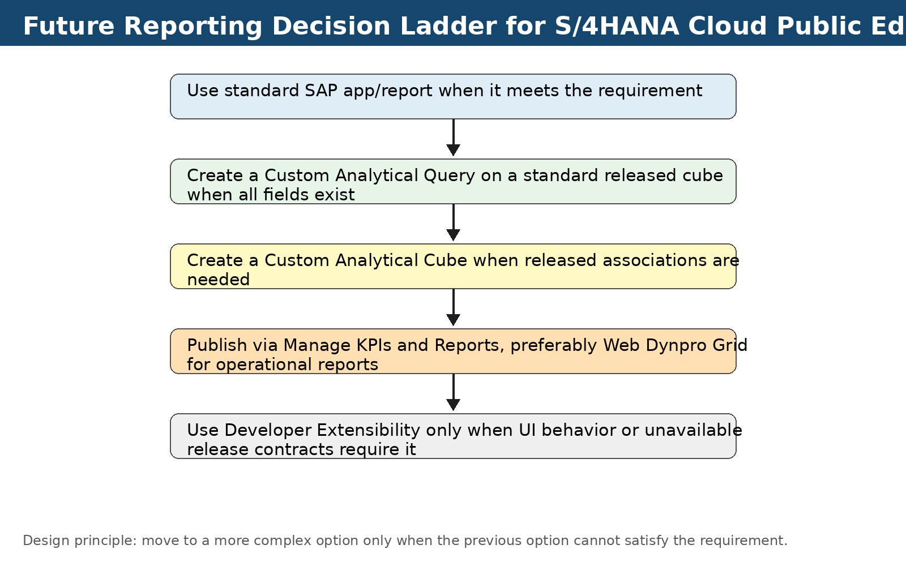

# 7. CDS View Inventory and Purpose

The following objects were identified and used or investigated. This inventory should be maintained as part of support documentation because it explains which data came from where and why each object was considered.

# 8. Custom Analytical Cube Design

The custom analytical cube created for the solution was YY1_IP19_MAINTPLAN_CUBE. The primary datasource was I_MaintPlanSchedgOverviewCube. Additional associations were added to provide the missing descriptive fields and operation text. The cube had to be built as an Analytical Cube, not a Standard CDS View.

During build, SAP required at least one measure. NumberOfMaintenancePlanCalls was added and configured with SUM aggregation. This was required because an analytical cube cannot be composed only of dimensions.

Association cardinality was another key learning. For standard CDS views, a 0..* association can be modelled. For an analytical cube, the system required associations suitable for analytical consumption. The associations were adjusted to Zero or One [0..1] to allow publication. For I_MaintOrderOperationBasic this is a known design caveat because a maintenance order can contain multiple operations. This means operation text should be validated with business data and accepted as part of the report design.

# 9. Custom Analytical Query Design

The Custom Analytical Query created was YY1_Q_IP19_MAINT_SCHED. The query was created only after the custom analytical cube was successfully published. An early error occurred when the query was created while the cube was still not fully published, which resulted in element usage errors. Recreating or refreshing the query after cube publication resolved the issue.

The query configured user input filters for the operational fields planners are expected to use, including maintenance plan, equipment, functional location, work center, planner group, call status, planned date, maintenance order and completion date. Multiple selection was enabled for appropriate fields. Planned Date was treated as a key planning filter.

The query initially rendered as a raw multidimensional analytical grid, which was technically correct but not planner-friendly. The improved delivery mechanism was to use Manage KPIs and Reports to create a Web Dynpro Grid Application artifact.

# 10. Manage KPIs and Reports Publication

Manage KPIs and Reports offered three artifact types for the custom analytical query: Embedded Analytics Cloud Story, WebDynpro Grid Application and Multidimensional Analysis. The WebDynpro Grid Application was selected because it provided the cleanest operational report experience for an IP19-style requirement. The SAC story option was more suitable for dashboards. The multidimensional analysis output was useful for analysis but too technical for business planners.

# 11. Delivered Report Outcome

The delivered Web Dynpro Grid Application produced a much cleaner and more acceptable business experience than the raw analytical query preview. It included filter bar, business columns, data grid, sorting, downloads and planner-friendly layout options. The final result was accepted as a viable IP19-equivalent report except for the remaining Due Packages gap.

# 12. Due Packages Gap and Business Criticality

Business confirmed that Due Packages is not optional. Planners require this field to understand which maintenance package or service package is due for a future call. Without it, the report is incomplete for go-live decision-making.

The standard Display Maintenance Plan screen shows Due Packages at the maintenance call level. SAP field help explains that due maintenance packages are determined dynamically from the maintenance strategy and task lists assigned to the maintenance plan or corresponding maintenance item. This means the value is not a simple standalone text field in the maintenance scheduling cube. It must be derived from maintenance strategy package relationships.

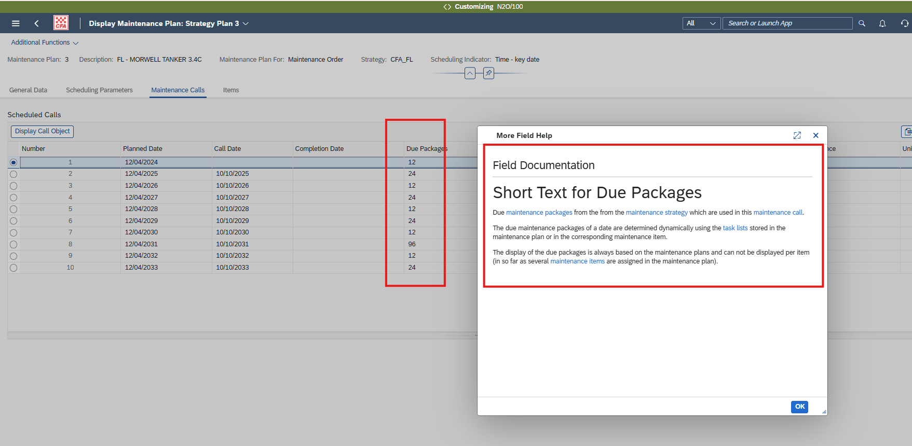

# 13. Reverse-Engineered Due Package Derivation Logic

The working derivation path identified through Customer Data Browser analysis is as follows. The custom report has Maintenance Plan and Maintenance Item. Using the maintenance item, C_MAINTENANCEITEMDEX_2 can provide task list assignment details such as Task List Type, Key for Task List Group and Group Counter. These values can be passed to I_MAINTTSKLISTSTRGYPACKAGETP to obtain Maintenance Package Number, Cycle Text and Operation Short Text. Cycle Text can support the Due Package requirement from a business interpretation perspective because it describes the service package/cycle due.

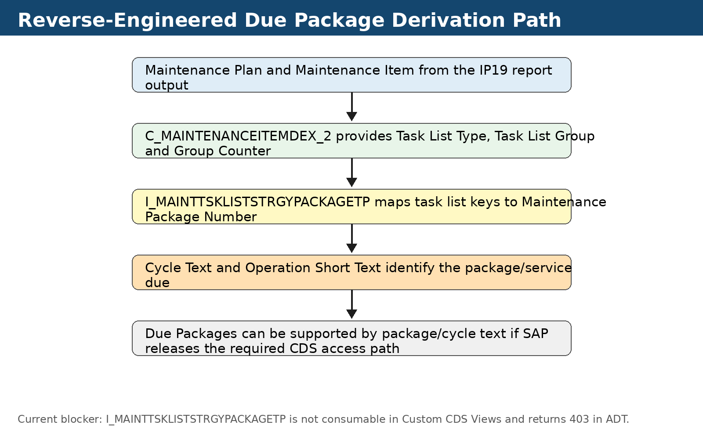

# 14. Evidence from Customer Data Browser

Customer Data Browser was used because it allowed direct verification that the SAP-delivered CDS object contains the required package information. This was not a theoretical analysis. The relevant CDS output was displayed and contained Maintenance Package Number, Cycle Text and Operation Short Text. C_MAINTENANCEITEMDEX_2 also confirmed the task list assignment path.

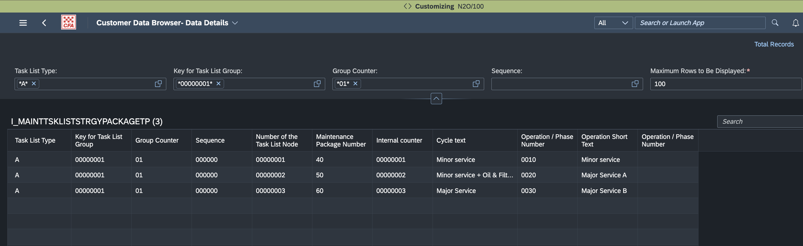

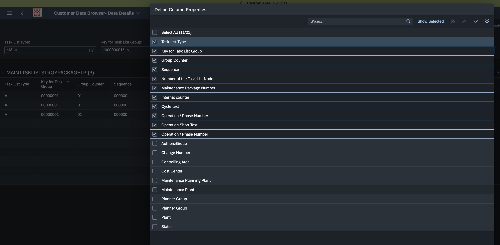

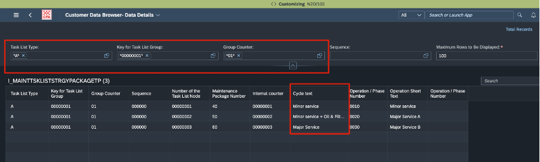

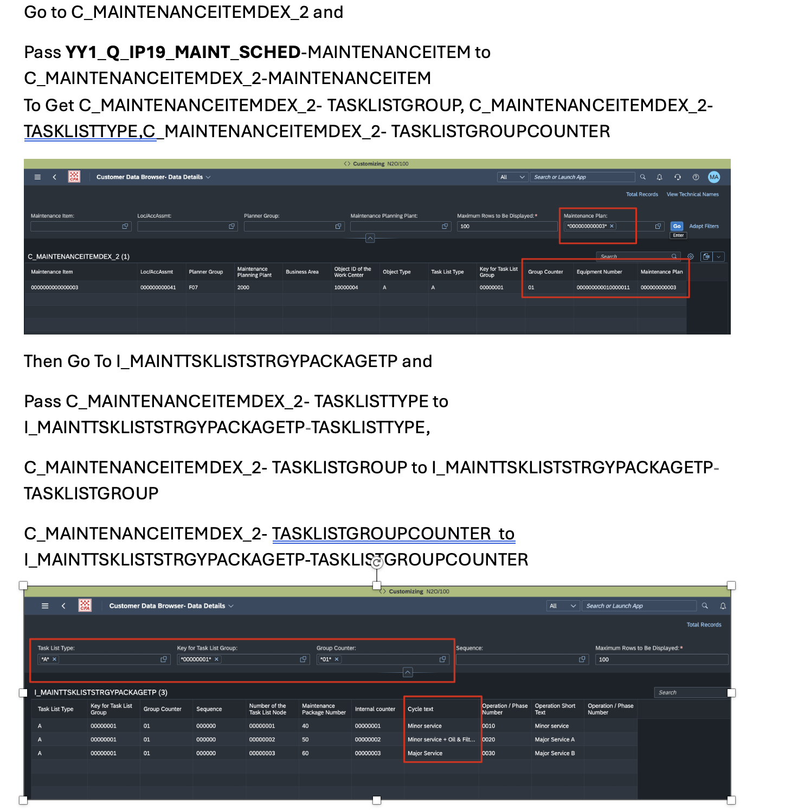

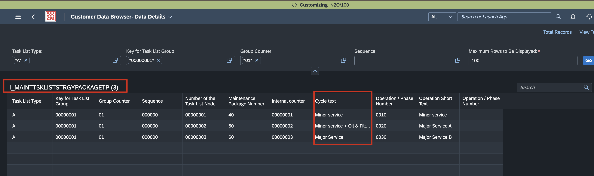

# 15. CDS Availability and Release Restriction Analysis

The key blocker is not the absence of data. The data exists and can be displayed through SAP-delivered CDS content in Customer Data Browser. The blocker is release/consumption availability across SAP extensibility tools.

I_MAINTTSKLISTSTRGYPACKAGETP is visible in Customer Data Browser and searchable in Eclipse ADT. However, it is not available as a datasource in Custom CDS Views. When opened as an ADT DDL source, the system returned HTTP 403 Forbidden. This creates an inconsistency: the business can see the data through one SAP tool, but customers cannot use the same data in the standard extensibility tooling required to build a complete report.

# 16. Developer Extensibility Investigation

Developer Extensibility was investigated only after the key-user route was blocked. Eclipse ADT was connected to the development tenant. Searching for I_MAINTTSKLISTSTRGYPACKAGETP returned multiple repository objects: entity, data definition, access control and Customer Data Browser object. This proved the object exists in the system repository.

Opening the Data Definition object resulted in a 403 Forbidden response for the ADT DDL source endpoint. This suggests either missing developer authorization or, more likely, that the object is not released for customer development. The recommended next technical check is to confirm whether the object is present under Released Objects in Eclipse ADT. If it is not present, the SAP incident position is stronger: the required data exists but SAP has not released a supported customer consumption object.

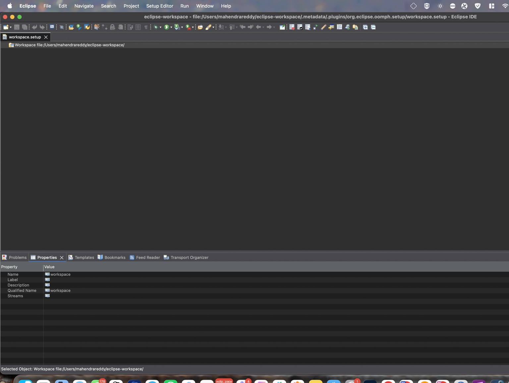

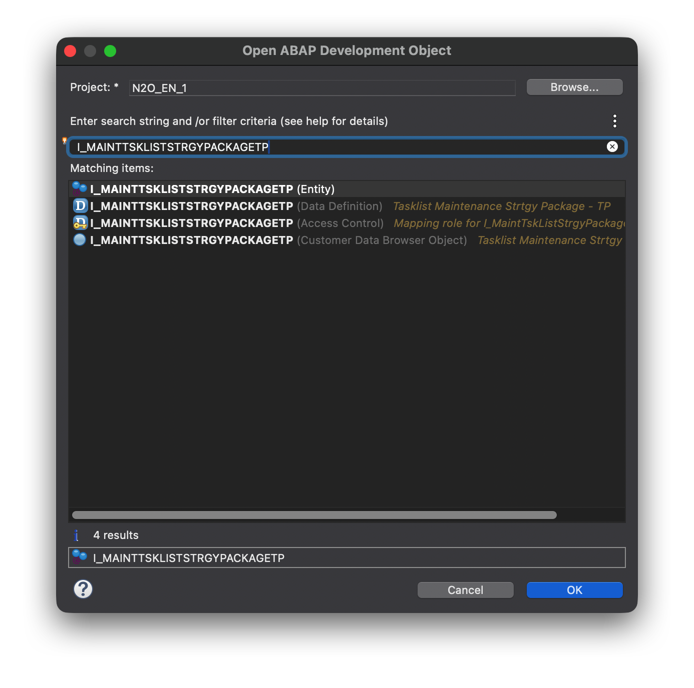

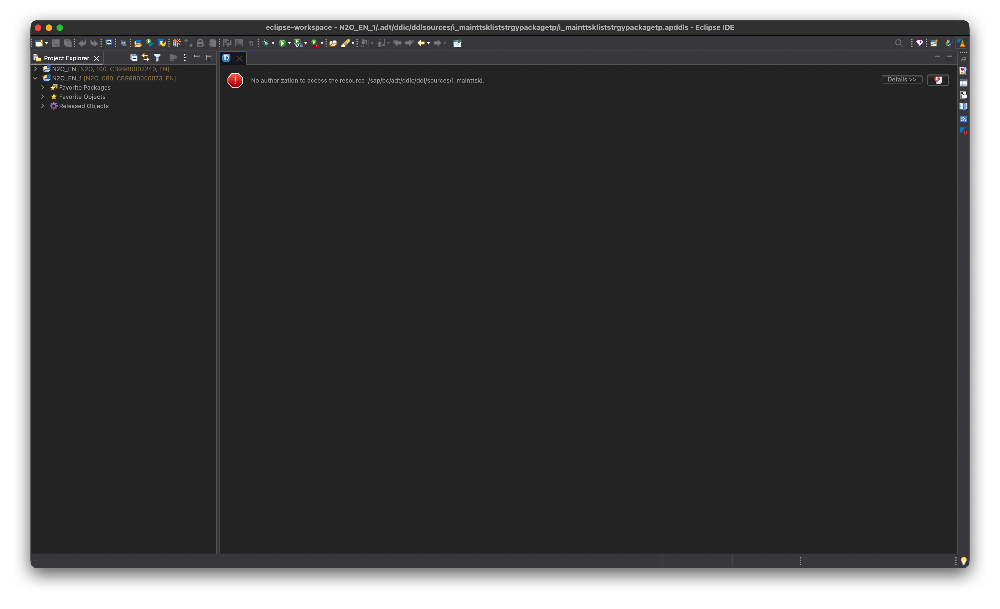

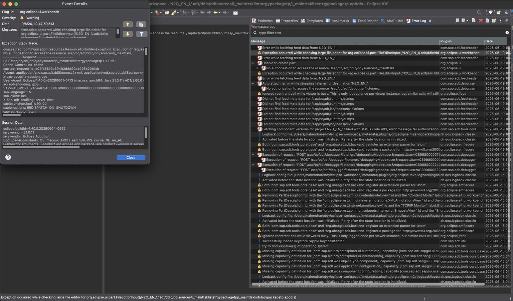

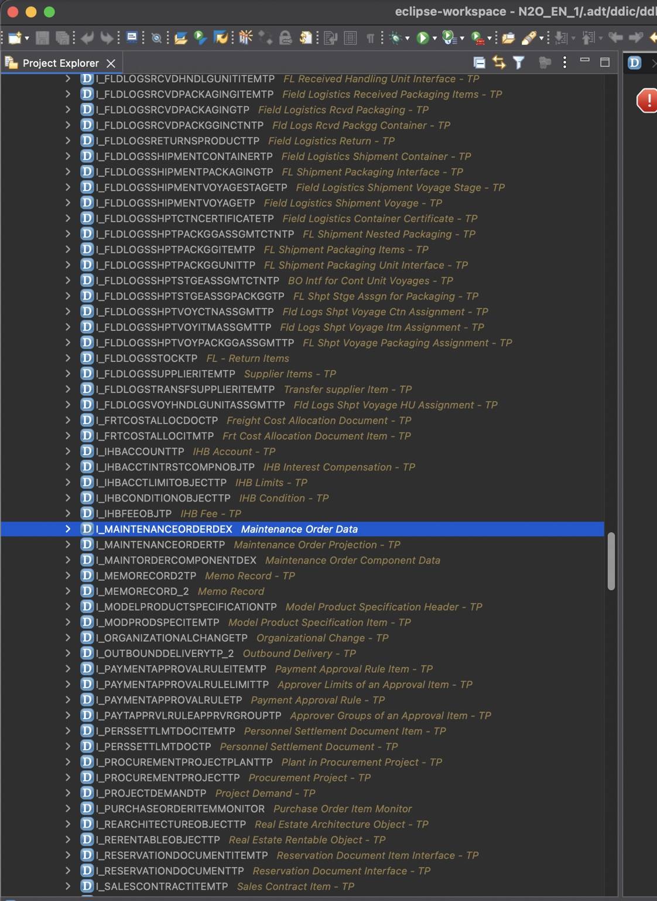

# 17. Options Assessment

Several options are available, but they do not all have the same level of supportability or business value.

# 18. SAP Request and Escalation Position

CFA is not requesting direct database table access and is not requesting an unsupported workaround. CFA is requesting a supported released consumption model for data that is already visible to the customer through SAP-delivered CDS content in Customer Data Browser.

The firm but collaborative request to SAP is as follows: please either release I_MAINTTSKLISTSTRGYPACKAGETP for Custom CDS Views and/or developer extensibility, provide an equivalent released CDS view, or add Due Packages to I_MaintPlanSchedgOverviewCube / the standard Maintenance Plan Scheduling analytical content. The current limitation prevents customers from reproducing standard SAP maintenance planning information in a customer-required operational report.

# 19. Business Impact and Go-Live Risk

Due Packages is central to maintenance planning because it identifies the service package due for a maintenance call. Without the field, planners would have to manually open individual maintenance plans and review scheduled calls, which undermines the purpose of the IP19-equivalent report. Business confirmed that go-live cannot proceed with the current report unless Due Packages is supported.

The risk is not cosmetic. It affects operational readiness, maintenance planning accuracy and planner productivity. The current report solves most of the reporting gap but the Due Packages field is now the only critical unresolved item.

# 20. Future Reporting Design Rules

This investigation produced a reusable design rule for future SAP S/4HANA Cloud Public Edition reporting. Start with the simplest supportable option and only move to the next layer when necessary.

# 21. Operational Handover

The delivered report components should be documented and transported according to standard SAP Cloud procedures. Support teams should understand that the report is built from a custom analytical cube and custom analytical query, not from a custom RAP application.

# 22. Recommended SAP Incident Text

Suggested incident title:
IP19 Equivalent Report - Due Packages Field Not Available in Released CDS / Extensibility Model

Suggested incident description:
CFA has built an IP19-equivalent maintenance planning report in SAP S/4HANA Cloud Public Edition using a custom analytical cube and custom analytical query. The report is based on I_MaintPlanSchedgOverviewCube and has been published through Manage KPIs and Reports as a Web Dynpro Grid Application. Most mandatory fields have been delivered successfully.

The remaining business-critical field is Due Packages. Standard SAP maintenance plan display shows Due Packages at maintenance call level. SAP field help indicates the value is dynamically determined from maintenance packages and maintenance strategy/task list assignment.

CFA identified that I_MAINTTSKLISTSTRGYPACKAGETP contains Maintenance Package Number, Cycle Text and Operation Short Text. C_MAINTENANCEITEMDEX_2 provides the join path from maintenance item to task list type, task list group and group counter. Therefore a valid derivation path exists. However, I_MAINTTSKLISTSTRGYPACKAGETP is visible in Customer Data Browser but not available in Custom CDS Views. In Eclipse ADT the object is searchable but opening the Data Definition returns HTTP 403 Forbidden.

CFA requests SAP to provide a released and supported CDS/API for consuming maintenance task list strategy package data, or to expose Due Packages in I_MaintPlanSchedgOverviewCube / standard maintenance scheduling analytics. The data already exists within SAP-delivered CDS content and is visible in a customer-facing SAP tool; the current blocker is lack of release for reporting extensibility consumption.

# 23. Appendix A - Evidence Register

# 24. Appendix B - Screenshot Appendix

The screenshots below are the screenshots that were available as files during document generation. Earlier screenshots from the live working session were not all retained as files, so this document includes the most relevant evidence available from the later due package and developer extensibility investigation.

# 25. Appendix C - Troubleshooting Notes

# 26. Appendix D - Future Enhancement Backlog

## Evidence Screenshots

### Figure 1: Standard Display Maintenance Plan screen showing Due Packages and SAP field help explaining due maintenance packages.

### Figure 2: Customer Data Browser output for I_MAINTTSKLISTSTRGYPACKAGETP showing Maintenance Package Number, Cycle Text and Operation Short Text.

### Figure 3: Column properties for I_MAINTTSKLISTSTRGYPACKAGETP showing available fields relevant to Due Package derivation.

### Figure 4: Customer Data Browser output for C_MAINTENANCEITEMDEX_2 showing maintenance item to task list mapping fields.

### Figure 5: Customer Data Browser filter by Maintenance Plan to identify task list type, task list group and group counter.

### Figure 6: Working notes documenting the join path from the report maintenance item to C_MAINTENANCEITEMDEX_2 and then to I_MAINTTSKLISTSTRGYPACKAGETP.

### Figure 7: Customer Data Browser task list strategy package output with cycle text examples.

### Figure 8: Additional Customer Data Browser evidence showing filtering and mapping context.

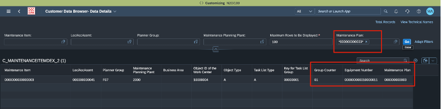

### Figure 9: Eclipse ADT startup view before restoring the ABAP perspective and project explorer.

### Figure 10: Open ABAP Development Object search result for I_MAINTTSKLISTSTRGYPACKAGETP showing entity, data definition, access control and Customer Data Browser object.

### Figure 11: ADT editor showing no authorization to access the DDL source for I_MAINTTSKLISTSTRGYPACKAGETP.

### Figure 12: Eclipse error log showing HTTP 403 Forbidden for the DDL source request.

### Figure 13: ADT Released Objects view showing example released maintenance objects and supporting the release-status investigation.

## SAP Request Summary

CFA requests SAP to provide one of the following supported options:

1. Release `I_MAINTTSKLISTSTRGYPACKAGETP` for Custom CDS Views / customer extensibility consumption.
2. Provide an equivalent released CDS/API exposing Maintenance Plan, Maintenance Item, Task List Type, Task List Group, Group Counter, Maintenance Package Number and Cycle Text.
3. Expose Due Packages directly in `I_MaintPlanSchedgOverviewCube` or the standard Maintenance Plan Scheduling analytical content.

CFA is not requesting direct table access. The data exists in SAP-delivered CDS content and is visible through Customer Data Browser. The gap is a release/consumption gap across customer extensibility tooling.
